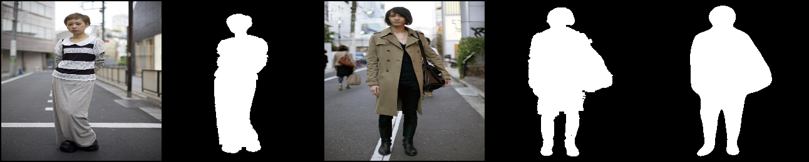
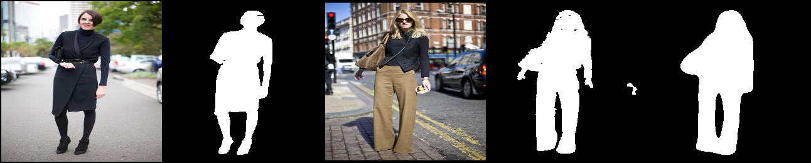
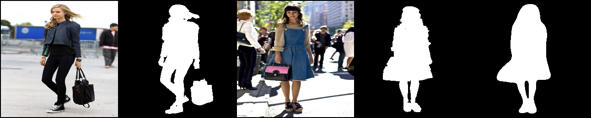
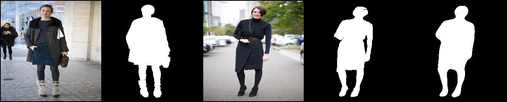

# Few Shot Segmentation
Few-shot segmentation method, using ResNet as encoder and UNetV3 as decoder. 
UNetV3 is from [Pytorch-UNet-2](https://github.com/upashu1/Pytorch-UNet-2)
ResNet is from torchvision.models

Method we use is similar to [Integrative Few-Shot Learning for Classification and Segmentation](http://cvlab.postech.ac.kr/research/iFSL/)
1. Feed query image, support image and support mask to the model.
2. Get layer 1 (L1), layer 2 (L2), layer 3 (L3) and layer 4 (L4) feature maps from ResNet for query(Q) and support images(S)
3. Check the cosine similarities of pixels from support and query image feature maps.(L1,L2,L3,L4)
    a. Example: Take one pixel location from L1 of Q and calculate cosine similarity between this pixel and the pixels from L1 of S. Repeat the process for all pixels in Q. 
4. The acquired cosine similarity matrix C is in this size: (Batch Size, Height*Width, Height, Width). And we have 4 cosine similarity matrices in total for L1, L2, L3, and L4.
5. Concatenate C1, C2, C3, C4. (Cc)
6. Flatten the support image mask and multiply it with Cc. This is to eliminate the effect of not desired (the pixels which are not in the mask area) pixels.
7. Put Cc in 2D 1x1 convolution to reduce the Height*Width number of feature maps to predetermined number (N) of feature maps. (Output: B, N, H, W)
8. Feed this feature map to UNET.
9. Get the generated mask and calculate BCELoss with generated mask and expected mask of query image.

## Results:
### Support Image & Mask:

